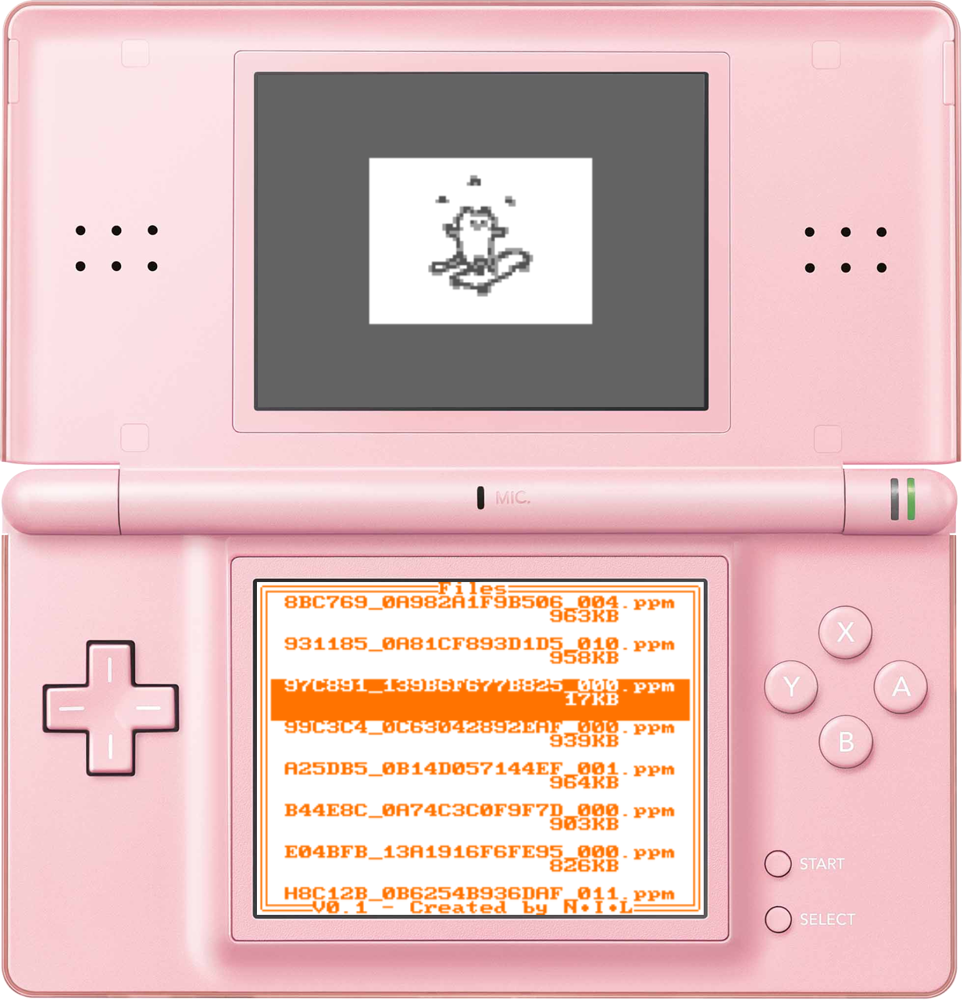
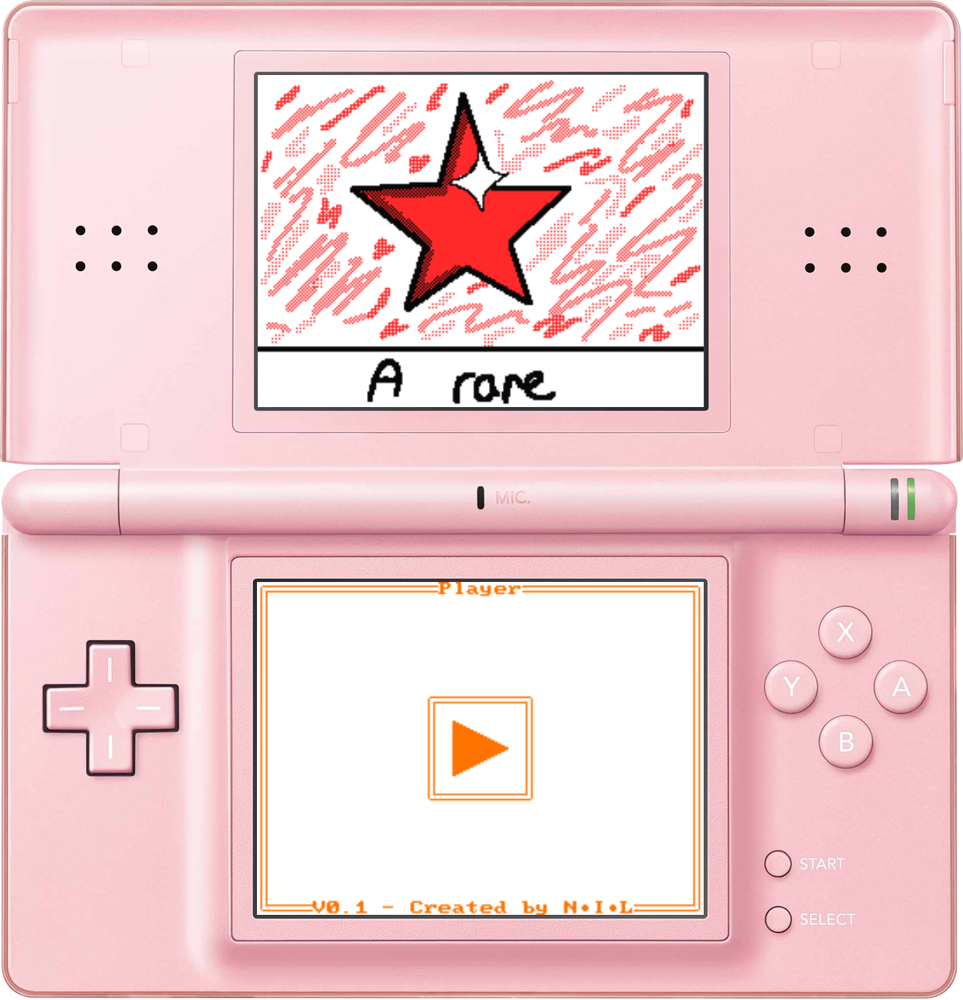

# </img> FSPDS V0.2.0
    

## Flipnote Studio Player for Nintendo DS

Note from January 2021 : *"Unburied" dekvkitPro from a 3yo hard disk backup, so I decided to give it a go :)*

This simple ROM allows you to play flipnotes on Nintendo DS (Lite) using your flashcard.

## How to use

1. Create a new folder named ```/flipnotes``` at the root of your SD card
1. Copy your favorite flipnotes to ```/flipnotes``` directory
1. Copy ```FSPDS.nds``` anywhere to your SD card
1. Insert your flashcard into the DS, then turn on the console
1. Launch ```FSPDS.nds```
1. Select a file from the menu using the D-pad
1. Press ```A``` to play it
1. Use ```L```/```R``` buttons to navigate through bottom-screen tabs

## Screenshots
<p align="center">
    </img>
    <br/>
    <i>Thumbnail of one of the sample flipnotes (Cat on a skateboard) displayed by FSPDS</i>
</p>


<p align="center">
    </img>
    <br/>
    <i>Capture of "eBay Song" flipnote by RANDOM☆GUY played by FSPDS</i>
</p>

## Bugs/Limitations

- FSPDS doesn't detect/play flipnotes larger than 1MB (this is intentional behavior)
- Don't place more than 1024 files in the ```/flipnotes``` directory, otherwise FSPDS won't be capable to see them all 
(also intentional behavior, probably will be changed in the future)
- The flipnote's BGM track should be smaller than 512KB in order to be played correctly. 

### Tested on DeSmuMe emulator and R4(i) flashcards

## Credits

- Guys from [DSiBrew](https://dsibrew.org/wiki/Flipnote_Files/PPM "PPM Format") and [Flipnote Collective](https://github.com/Flipnote-Collective/flipnote-studio-docs/wiki/PPM-format "PPM Format") for their awesome documentation on .PPM file format.
- [devkitPro](https://github.com/devkitPro) for their compiler, ndslib and examples
- The authors behind [GodMode9i](https://github.com/DS-Homebrew/GodMode9i "GodMode9i") for the idea of overwriting character fonts
- [Drenn1/GameYob](https://github.com/Drenn1/GameYob "Drenn1/GameYob") repo for helping me figure out how to work with makefiles.
- [RinLovesYou](https://github.com/miso-xyz/PPMLib/commits?author=RinLovesYou) for her [ADPCM to PCM Decode() method from PPMLib](https://github.com/miso-xyz/PPMLib/blob/c7548bf4cdb0e368af552c71a45eb9f96f2e3385/PPMLib/Extensions/AdpcmDecoder.cs#L46-L119)
